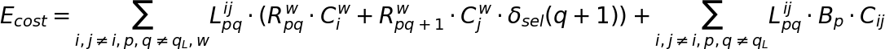
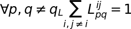
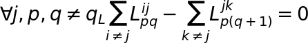
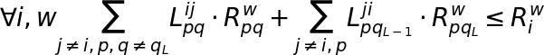
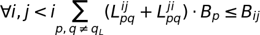
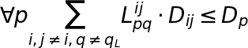

# VNF Quantum Optimization
This repository contains the source code for the article "Virtual Network Function Embedding with Quantum Annealing" accepted at [QCE22 - IEEE International Conference on Quantum Computing and Engineering](https://qce.quantum.ieee.org/2022/)

## Formulation
Cost function for node and link operation:

Constraint VNF allocation. Each VNF must be allocated exactly once:

Constraint on SFC continutiy:

Constraint on node resouce utilization:

Constraint on link bandwidth utilization:

Constraint on SFC link induced delay:

## Change formulas
Update the "formula.tex" file in "res/tex" and use the script "res/equation_render.py" to regenerate the images.

## External resources
https://pyvis.readthedocs.io/en/latest/index.html
https://www.yworks.com/products/yed

